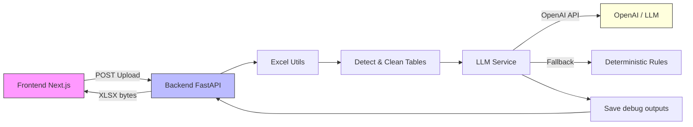
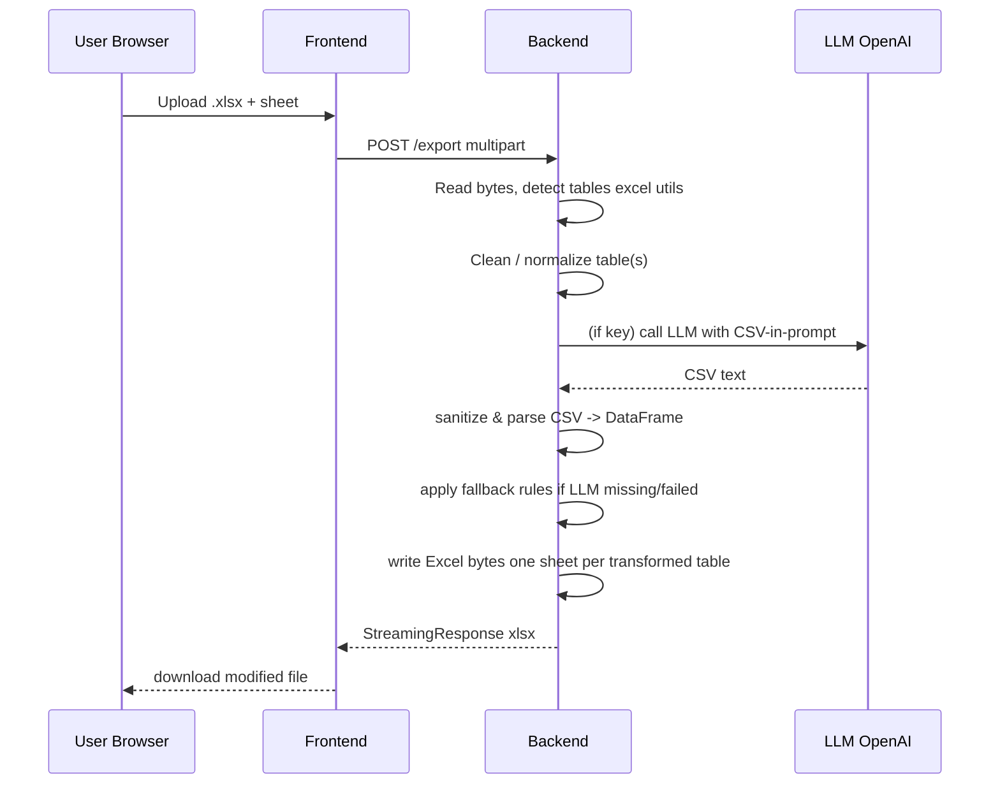

# Excel AI Modifier — Project (Frontend + Backend)

English / Spanish: [README.en.md](./README.en.md) • [README.md](./README.md)

A project that cleans and detects tabular blocks within Excel files and applies transformations driven by rules using an LLM (OpenAI) or a deterministic fallback. This guide explains how the solution is designed, how to run it, and how to configure it step by step.

Contents
- Overview
- Architecture (Mermaid diagrams)
- Components (frontend / backend)
- How to configure `.env` (backend and frontend)
- How to run locally (PowerShell)
- Endpoints and data flow
- Testing
- Debugging and troubleshooting
- Best practices and next steps

---

## Overview

This solution consists of two main parts:

- Frontend: a small Next.js application that provides a UI to upload an Excel file, select a sheet and download the modified result.
- Backend: a FastAPI service that orchestrates reading the file, detecting and cleaning tables, and transforming (via LLM or deterministic rules). The backend exposes endpoints to return sample rules and to export the modified Excel.

Processing (cleaning, table detection, LLM enrichment and final Excel creation) happens on the backend for control, reproducibility and security.

---

## Architecture

Macro diagram (components & flow):



Sequence for `/export`:



---

## Key components

- backend_api/
  - `app/utils/excel_utils.py` — in-memory reading, header detection and normalization, DataFrame <-> Excel bytes utilities.
  - `app/services/excel_service.py` — advanced detection/cleaning of tabular blocks and orchestration of export process.
  - `app/services/llm_service.py` — calls LLM (if API key), sanitizes response, retries and deterministic fallback. Saves raw outputs to `backend_api/data/llm_debug/` when the response cannot be parsed.
  - `app/api/router.py` — endpoints `/sample-data` and `/export`.
  - `app/utils/logging_config.py` — logging with rotation to `backend_api/data/logs/app.log`.

- frontend/
  - `components/ExcelViewer.tsx` — UI to upload Excel, select sheet and call backend.
  - `lib/excel.ts` — client utilities to preview spreadsheets.

---

## Environment variables

Create a `.env` file inside `backend_api/` (or use the provided `.env` for tests). Variables:

- `OPENAI_API_KEY` (optional): API key for OpenAI. When omitted, the backend uses a deterministic fallback.
- `LOG_LEVEL` (optional): logging level (INFO, DEBUG, WARNING).

Example `.env`:

```ini
OPENAI_API_KEY=sk-xxxxx
LOG_LEVEL=INFO
```

Frontend: use `.env.local` in the `frontend/` directory for client-side vars if needed. By default the UI expects the backend at `http://localhost:8000`.

---

## How to run locally (PowerShell)

Backend (FastAPI):

```powershell
cd backend_api
python -m venv .venv
. .venv/Scripts/Activate.ps1
pip install -r requirements.txt
# optional: sample rules are in backend_api/data/sample_test3.json
uvicorn main:app --reload --host 0.0.0.0 --port 8000
```

Frontend (Next.js):

```powershell
cd frontend
npm install
npm run dev
# Open http://localhost:3000
```

Direct test with curl (upload + sheet):

```powershell
curl -F "file=@C:\path\to\my.xlsx" -F "sheet=Sheet1" http://127.0.0.1:8000/export --output modified.xlsx
```

---

## Important endpoints

- `GET /sample-data` — returns the sample rules JSON found at `backend_api/data/sample_test3.json`.
- `POST /export` — accepts `file` (multipart UploadFile) and `sheet` (form param) and returns an `.xlsx` file.

Flow recap for `/export`:

1. Read uploaded bytes.
2. Detect & clean tables with heuristics. If multiple tables are found for the requested sheet, transform each and output as separate sheets.
3. For each table try the LLM path (CSV in prompt, expect CSV back).
4. If LLM is unavailable or fails, apply deterministic fallback `_mock_apply_rules`.

---

## Testing

Install pytest in the backend environment and run tests:

```powershell
cd backend_api
. .venv/Scripts/Activate.ps1
pip install pytest
pytest -q backend_api/tests/test_excel_service.py backend_api/tests/test_llm_service.py
```

Tests cover:
- Cleaning heuristics (header detection, trimming)
- LLM flow: mock returning valid CSV and a failure case which verifies debug file creation.

---

## Debugging & logs

- General logs: `backend_api/data/logs/app.log` (rotated files)
- Raw LLM outputs when parsing fails: `backend_api/data/llm_debug/llm_raw_<timestamp>.txt`

If the LLM response is malformed or unparsable the backend writes the raw output for inspection and falls back to deterministic rules. Check logs + debug folder to investigate.

---

## Best practices & next steps

- Enforce file size limits for `/export` (e.g., max rows or MB) and return 413 for large uploads.
- Move long transforms to an asynchronous queue/worker instead of blocking the HTTP request.
- Add e2e tests covering frontend->backend with a fixture Excel file.
- Add rate-limiting / quotas to protect the LLM integration.

---

If you want I can:
- Add more detailed diagrams and include them in the docs.
- Provide the prompt templates and a JSON Schema for `sample_test3.json`.
- Add CI scripts for running tests and linters.

Thanks — tell me if you want further additions.
