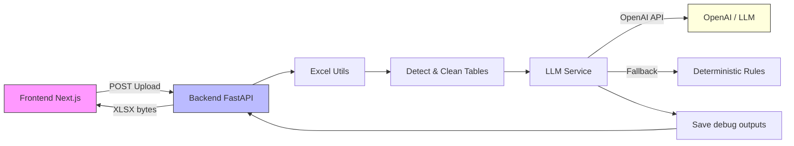
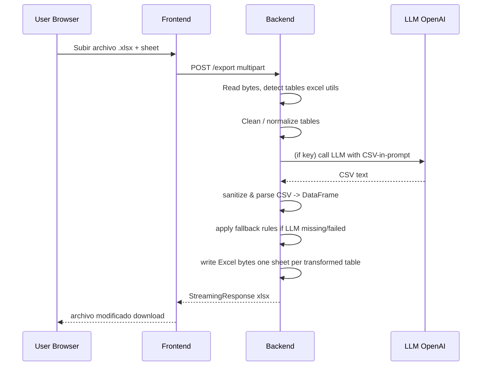

# Excel AI Modifier — Proyecto (Frontend + Backend)

English version: [README.en.md](./README.en.md) • Versión en español: [README.md](./README.md)

Un proyecto que limpia, detecta tablas en archivos Excel y aplica transformaciones basadas en reglas usando un LLM (OpenAI) o una implementación determinista como fallback. Esta guía explica cómo está diseñada la solución, cómo ejecutarla y cómo configurarla paso a paso.

Contenido
- Visión general
- Arquitectura (diagramas Mermaid)
- Componentes (frontend / backend)
- Cómo configurar `.env` (backend y frontend)
- Cómo ejecutar localmente (PowerShell)
- Endpoints y flujo de datos
- Testing
- Debugging y troubleshooting
- Buenas prácticas y próximos pasos

---

## Visión general

Esta solución consta de dos partes principales:

- Frontend: una pequeña aplicación Next.js que ofrece una UI para subir Excel, seleccionar hoja y descargar el resultado modificado.
- Backend: un servicio FastAPI que orquesta la lectura del archivo, la detección y limpieza de tablas, y la transformación (por LLM o por reglas deterministas). El backend expone endpoints para obtener reglas de ejemplo y para exportar el Excel modificado.

El objetivo es que el procesamiento principal (limpieza, detección de tablas, enriquecimiento con LLM y creación del Excel final) ocurra en el backend para mantener control, reproducibilidad y seguridad.

---

## Arquitectura

Diagrama macro (componentes y flujo):



Detalle del flujo de petición `/export`:



---

## Componentes clave

- backend_api/
  - `app/utils/excel_utils.py` — lectura en memoria, heurísticas de normalización y utilidades de conversión DataFrame <-> Excel bytes.
  - `app/services/excel_service.py` — detección/limpieza avanzada de bloques/tablas y orquestación del proceso de export.
  - `app/services/llm_service.py` — llama al LLM (si hay API key), sanitiza la salida, reintentos y fallback determinista. Guarda outputs crudos en `backend_api/data/llm_debug/` si la salida no es parseable.
  - `app/api/router.py` — define endpoints `/sample-data` y `/export`.
  - `app/utils/logging_config.py` — configuración de logging con rotación para `backend_api/data/logs/app.log`.

- frontend/
  - `components/ExcelViewer.tsx` — UI para subir Excel, seleccionar hoja y disparar la llamada al backend.
  - `lib/excel.ts` — utilidades en el cliente para mostrar previews.

---

## Configurar variables de entorno

Crear un archivo `.env` en `backend_api/` (o usar `.env` ya incluido para pruebas). Variables relevantes:

- `OPENAI_API_KEY` (opcional): clave para usar OpenAI. Si no se provee, el backend usará un fallback determinista.
- `LOG_LEVEL` (opcional): nivel de logging (INFO, DEBUG, WARNING).

Ejemplo `.env`:

```ini
OPENAI_API_KEY=sk-xxxxx
LOG_LEVEL=INFO
```

Frontend: si necesitas exponer variables al cliente, usa `.env.local` en la carpeta `frontend/` (sigue las instrucciones de Next.js). Por defecto la UI solo apunta a `http://localhost:8000`.

---

## Cómo ejecutar localmente (PowerShell)

Backend (Python / FastAPI):

```powershell
cd backend_api
python -m venv .venv
. .venv/Scripts/Activate.ps1
pip install -r requirements.txt
# (opcional) export sample rules file is in backend_api/data/sample_test3.json
uvicorn main:app --reload --host 0.0.0.0 --port 8000
```

Frontend (Next.js):

```powershell
cd frontend
npm install
npm run dev
# Open http://localhost:3000
```

Probar endpoint `/export` directamente con curl (subir archivo y pedir sheet):

```powershell
# desde PowerShell
curl -F "file=@C:\ruta\a\mi.xlsx" -F "sheet=Sheet1" http://127.0.0.1:8000/export --output modified.xlsx
```

---

## Endpoints importantes

- `GET /sample-data` — devuelve el JSON de reglas de ejemplo ubicado en `backend_api/data/sample_test3.json`.
- `POST /export` — recibe `file` (multipart UploadFile) y `sheet` (form param) y devuelve un `.xlsx` resultante.

La lógica principal en `/export` hace:

1. Lee los bytes del archivo subido.
2. Detecta/limpia tablas con heurísticas. Si se detectan múltiples tablas para la hoja solicitada, cada tabla se transforma por separado y se escribe como hoja separada en el Excel final.
3. Para cada tabla intenta usar el LLM para transformar a CSV (se envía el CSV original en el prompt y se espera CSV de vuelta).
4. Si el LLM falla o no hay clave, aplica `_mock_apply_rules` (fallback determinista).

---

## Testing

Instalar pytest en el entorno del backend y ejecutar los tests:

```powershell
cd backend_api
. .venv/Scripts/Activate.ps1
pip install pytest
pytest -q backend_api/tests/test_excel_service.py backend_api/tests/test_llm_service.py
```

Los tests incluidos cubren:
- heurísticas de limpieza (`clean_block`, detección de tablas)
- flujo LLM: test que simula una respuesta CSV válida y test que fuerza un fallo y comprueba que se crea un archivo debug.

---

## Debugging y logs

- Logs generales: `backend_api/data/logs/app.log` (rotating handler).
- Salida cruda del LLM cuando no es parseable: `backend_api/data/llm_debug/llm_raw_<timestamp>.txt`.

Si el LLM devuelve texto no-CSV, se guarda en `llm_debug` y el backend aplica el fallback. Revisa `app.log` y los archivos en `llm_debug` para investigar.

